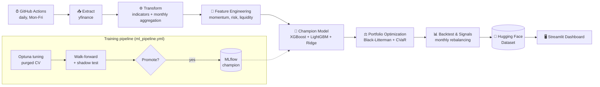

<div align="center">

# 📈 AlphaEdge: AI-Powered Multi-Market Portfolio Manager

**A quantitative portfolio system with a fully automated daily MLOps pipeline**

Machine-learning driven stock selection and portfolio allocation, deployed on the CAC40 with an architecture designed to extend to other markets.

[](https://www.python.org/downloads/)
[](https://cac40-smart-portfolio-asset.streamlit.app/)
[](https://soradata-alphaedge-registry.hf.space)
[](https://github.com/SORADATA/CAC40-Quantitative-Analysis-Predictive-Asset-Allocation/releases)
[](https://opensource.org/licenses/MIT)
[](https://github.com/psf/black)

[🌐 **Live Dashboard**](https://cac40-smart-portfolio-asset.streamlit.app/) •
[📊 **Performance**](#-performance) •
[🏗️ **Architecture**](#️-architecture) •
[🚀 **Quick Start**](#-quick-start) •
[🐛 **Issues**](https://github.com/SORADATA/CAC40-Quantitative-Analysis-Predictive-Asset-Allocation/issues)

</div>

---

## 🎯 Overview

AlphaEdge predicts, every month, which stocks of an index are likely to deliver a positive return, then turns those predictions into a risk-controlled portfolio.

It combines in a single codebase:

- **Feature engineering** on daily price data (momentum, risk, liquidity, technical indicators)
- **An ensemble classifier** (XGBoost + LightGBM + Ridge, stacked) that outputs an upside probability per stock
- **Portfolio optimization** (Black-Litterman + CVaR minimization)
- **A daily automated pipeline** (GitHub Actions) that refreshes data, signals and the dashboard
- **A model registry and promotion workflow** (MLflow) so that a new model only goes live if it beats the current champion

The production setup targets the **CAC40**. Market-specific settings live in `config/markets/`, so other universes can be added without touching the core code.

---

## 🌟 Core Features

### 🧠 Machine Learning
- Stacked ensemble: **XGBoost + LightGBM + calibrated Ridge**, combined by a **Logistic Regression** meta-model
- Hyperparameter search with **Optuna**, validated with **purged cross-validation and embargo** to avoid temporal leakage
- **Walk-forward evaluation** and a **shadow test** against the current champion before any promotion

### ⚖️ Portfolio Construction
- **Black-Litterman**, with views derived from the model's upside probabilities
- **EfficientCVaR (95%)** to control tail risk, with weight bounds
- **Ledoit-Wolf** covariance shrinkage for stable estimates
- Monthly rebalancing with turnover, transaction costs and management fees; equal-weight fallback if the optimizer fails

### ☁️ MLOps
- Daily scheduled run (Mon-Fri) via GitHub Actions, plus manual trigger
- **MLflow** registry with a `champion` alias; artifacts stored on Hugging Face
- Local model fallback (`ensemble_model.pkl` + `model_card.json`) if the remote registry is unavailable
- Hugging Face Dataset used as the single source of truth for the dashboard

### 📊 Visualization
- Streamlit dashboard: KPIs, strategy vs benchmark, drawdown, allocation, daily signals, model details, rebalance history

---

## 📸 Dashboard Preview

<div align="center">

| Portfolio Performance | AI Trading Signals |
|:---:|:---:|
|  |  |

</div>

---

## 📊 Performance

> ⚠️ Backtest results, **not live trading results**. Past performance does not guarantee future results.

| Metric | Strategy | CAC40 (benchmark) |
|---|:---:|:---:|
| Annualized return | _TBD_ | _TBD_ |
| Annualized volatility | _TBD_ | _TBD_ |
| Sharpe ratio | _TBD_ | _TBD_ |
| Max drawdown | _TBD_ | _TBD_ |
| Calmar ratio | _TBD_ | _TBD_ |
| Avg. monthly turnover | _TBD_ | n/a |

**Backtest setup** (fill in before publishing):

- Period: _YYYY-MM to YYYY-MM_
- Rebalancing: monthly
- Transaction cost: _X bps_ per trade (`TRANSACTION_COST`), management fee: _X%_ per year
- Universe: current CAC40 constituents _(see Limitations: survivorship bias)_

---

## 🏗️ Architecture



The top row is the **daily inference pipeline**; the bottom box is the **training pipeline**, which only updates the production model when a challenger beats the champion.

👉 For a step-by-step breakdown of each stage, see [`docs/architecture.md`](docs/architecture.md).

### Main Components

| Layer | Responsibility | Location |
|---|---|---|
| Extraction | Market data download, validation, incremental update | `src/extract/` |
| Transform | Cleaning, daily indicators, monthly aggregation, Fama-French betas | `src/transform/` |
| Features | Momentum, mean reversion, risk-adjusted, liquidity, seasonality | `src/features/` |
| Models | Ensemble, purged CV, training, champion loading | `src/models/` |
| Pipeline | ETL, backtest, optimization, daily run | `src/pipeline/` |
| Presentation | Streamlit dashboard | `app.py` |

---

## 🧭 Design Choices

- **Purged CV with embargo**: monthly targets overlap in time, so a standard K-fold would leak future information into training. Purging and an embargo period prevent this.
- **Stacking with out-of-fold probabilities**: the meta-model is trained on OOF predictions only, so it never sees in-sample base-model outputs.
- **Black-Litterman**: ML probabilities are used as *views* on top of a market prior, which avoids the extreme weights that raw expected-return forecasts typically produce.
- **CVaR instead of variance**: equity returns have fat tails; minimizing Expected Shortfall targets the losses that actually matter.
- **Ledoit-Wolf shrinkage**: with ~40 assets and 252 daily observations, the sample covariance matrix is noisy. Shrinkage makes the optimization more stable.
- **Champion / challenger promotion**: a new model must pass walk-forward metrics and a shadow test (`SHARPE_THRESHOLD`, `MAX_DD_THRESHOLD`) before replacing the production model.

---

## 🚀 Quick Start

### Prerequisites

- Python 3.10+
- Git
- Recommended: a virtual environment
- Optional: `HF_TOKEN` for Hugging Face sync and registry access

### Installation

```bash
git clone https://github.com/SORADATA/CAC40-Quantitative-Analysis-Predictive-Asset-Allocation.git
cd CAC40-Quantitative-Analysis-Predictive-Asset-Allocation
python -m venv venv
source venv/bin/activate  # On Windows: venv\Scripts\activate
pip install -r requirements.txt
```

### Usage

```bash
# Launch the dashboard
streamlit run app.py

# Run the daily pipeline (extract -> features -> scoring -> optimization -> publish)
python src/pipeline/daily_run.py

# Train a new challenger model
python src/models/train.py
```

---

## 📂 Project Structure

```text
.
├── .github/workflows/        # daily_update, ml_pipeline, release, pre-release, python-app
├── config/markets/           # one config file per market (cac40.json)
├── docs/                     # architecture.md and dashboard screenshots
├── notebooks/                # exploratory analysis
├── src/
│   ├── extract/              # MarketExtractor (yfinance)
│   ├── transform/            # MarketDataProcessor, ticker management
│   ├── features/             # alpha_features.py
│   ├── models/               # ensemble, cv, train, model_loader, local fallback models
│   ├── pipeline/             # etl, backtest, daily_run
│   └── utils/                # config, logging, metrics, math helpers
├── tests/
├── app.py                    # Streamlit dashboard
├── const.py                  # global parameters and thresholds
├── requirements.txt
├── CHANGELOG.md
└── CONTRIBUTING.md
```

---

## 🔧 Customization

### Add a new market

Create a new file in `config/markets/`, for example `sp500.json`:

```json
{
  "market_name": "SP500",
  "tickers": ["AAPL", "MSFT", "GOOGL", "AMZN", "NVDA"],
  "ff_region": "US",
  "benchmark_ticker": "^GSPC"
}
```

`daily_run.py` loops over every market configuration, so the new market is picked up automatically. A dedicated model can be trained and stored in `src/models/<MARKET>/`.

### Key parameters

| Parameter | Role |
|---|---|
| `SHARPE_THRESHOLD` | Minimum Sharpe required for promotion |
| `MAX_DD_THRESHOLD` | Maximum drawdown allowed for promotion |
| `PROBA_MIN` | Minimum upside probability for a stock to be selected |
| `MAX_STOCKS_SELECT` | Maximum number of selected stocks |
| `MIN_STOCKS_OPTIM` | Minimum number of stocks required to run the optimizer |
| `TRANSACTION_COST` | Cost applied at each rebalance |
| `BACKTEST_YEARS` | Lookback window used in backtesting |

---

## ⚠️ Limitations

- **Survivorship bias**: the universe is based on current constituents, which flatters historical results.
- **Simplified execution**: no slippage, market impact or liquidity constraints beyond the flat transaction cost.
- **Data quality**: yfinance is a free source with occasional gaps and corporate-action errors.
- **Backtest overfitting risk**: hyperparameter tuning and repeated model selection on the same history can overstate performance.
- **Single-market validation**: results on the CAC40 do not necessarily transfer to other universes.

---

## 🤝 Contributing

Contributions are welcome through issues, discussions and pull requests. See [CONTRIBUTING.md](CONTRIBUTING.md).

Before opening a PR:

```bash
black src/ --check
flake8 src/
pytest tests/
```

---

## ⚠️ Disclaimer

This repository is for **educational and research purposes only**. It does not constitute financial advice, and past performance does not guarantee future results.

---

## 🙏 Acknowledgments

Developed as part of the **Master 2 - Statistics Expertise for Finance & Economics** program at **Université de Lorraine**.

Built on the open-source ecosystem around Streamlit, scikit-learn, XGBoost, LightGBM, PyPortfolioOpt, Optuna and MLflow.

---

<div align="center">

**Developed by [SORADATA](https://github.com/SORADATA)**

</div>