# AlphaEdge: Detailed Architecture

This document describes each stage of the AlphaEdge pipeline. For a high-level overview, see the [README](../README.md#️-architecture).

The system has two independent flows:

- **Daily inference pipeline** (stages 0 to 9): refreshes data, scores stocks, builds the portfolio and publishes results.
- **Training pipeline** (bottom of the diagram): trains a challenger model and promotes it to champion only if it passes the safety checks.

The two are connected through the **champion model**, loaded at stage 4.

---

## Full diagram

```mermaid
graph TB
    subgraph P0["0 · Trigger and configuration"]
        direction TB
        Z1["⏰ GitHub Actions · daily_update.yml<br/>cron Mon-Fri + manual dispatch"] --> Z2["daily_run.py · loops over config/markets/*.json<br/>market_name · tickers · ff_region · benchmark_ticker"]
    end

    subgraph P1["1 · EXTRACT · MarketExtractor"]
        direction TB
        A1["Apply ticker changes<br/>and exclude delisted stocks"] --> A2{"Raw CSV exists?"}
        A2 -- No --> A3["Full download · history_years"]
        A2 -- Yes --> A4["Delta · last_date - 5 days"]
        A3 --> A5["yfinance.download · retry x3, 5 s"]
        A4 --> A5
        A5 --> A6["Parse to MultiIndex date, ticker<br/>lowercase columns"]
        A6 --> A7{"Valid?<br/>empty · adj close missing · all NaN"}
        A7 -- No --> A5
        A7 -- Yes --> A8["Merge with existing data<br/>deduplicate keep=last"]
        A8 --> A9[("data/raw/market/market_raw.csv")]
    end

    subgraph P2["2 · TRANSFORM · MarketDataProcessor"]
        direction TB
        B1["adj close proxy = close if missing"] --> B2["Ticker validation and cleaning<br/>delisted / stale alerts"]
        B2 --> B3["Daily indicators<br/>RSI · Bollinger · ATR · MACD · Garman-Klass · euro_volume"]
        B3 --> B4["Monthly aggregation, business month-end<br/>mean volume · last value for other columns"]
        B4 --> B5["Fama-French betas by region<br/>RollingOLS · 1-month shift"]
        B5 --> B6["Alpha features · see stage 3"]
        B6 --> B7["t-1 lags of macro and volume variables"]
        B7 --> B8[("daily_raw.parquet · monthly_features.parquet<br/>+ ticker_validation.json")]
    end

    subgraph P3["3 · FEATURE ENGINEERING · alpha_features.py"]
        direction TB
        C1["Momentum · 1 to 12 month returns"] --> C2["Mean reversion · 12-month z-score"]
        C2 --> C3["Volatility · realized 3 and 12 months"]
        C3 --> C4["Risk-adjusted · Sharpe · Sortino · Calmar"]
        C4 --> C5["Tail risk · skew · kurtosis · VaR · CVaR"]
        C5 --> C6["Liquidity · Amihud · volume trend"]
        C6 --> C7["Seasonality · sin/cos of month"]
        C7 --> C8["Cross-sectional ranks per date"]
        C8 --> C9["t-1 lags · replace inf and NaN with 0"]
    end

    subgraph P4["4 · CHAMPION MODEL · model_loader"]
        direction TB
        D1["Load champion.pkl from Hugging Face"] --> D2{"Available?"}
        D2 -- No --> D3["Fallback to local pickle"]
        D2 -- Yes --> D4["In-memory cache"]
        D3 --> D4
    end

    subgraph P5["5 · SCORING AND SELECTION · backtest.py"]
        direction TB
        E1["Warm-up · exclude stocks with less than 12 months of history"] --> E2["Scoring · upside probability per ticker<br/>XGBoost + LightGBM + Ridge into meta-model"]
        E2 --> E3["Selection · proba >= PROBA_MIN<br/>top MAX_STOCKS_SELECT"]
    end

    subgraph P6["6 · PORTFOLIO OPTIMIZATION"]
        direction TB
        F1["Last 252 days of prices for selected stocks"] --> F2["Ledoit-Wolf covariance"]
        F2 --> F3["Black-Litterman · views from probabilities"]
        F3 --> F4["EfficientCVaR 95% · weight bounds"]
        F4 -. "failure or fewer than MIN_STOCKS" .-> F5["Equal weight"]
    end

    subgraph P7["7 · SIMULATION AND SIGNALS"]
        direction TB
        G1["Monthly rebalance · turnover after weight drift"] --> G2["Transaction costs + daily management fees"]
        G2 --> G3["Strategy vs Benchmark curve"]
        G3 --> G4["Live signals of the day · BUY or NEUTRAL + allocation"]
    end

    subgraph P8["8 · PUBLISH"]
        direction TB
        H1[("portfolio_history · rebalance_history<br/>latest_signals · data_metadata.json")] --> H2["Local parquet save"]
        H2 --> H3[("Upload to Hugging Face Dataset<br/>source of truth")]
    end

    subgraph P9["9 · DASHBOARD · Streamlit app.py"]
        direction TB
        I1["Load data from Hugging Face"] --> I2["Dashboard · KPIs · curve vs benchmark · drawdown · allocation"]
        I2 --> I3["Daily Signals"]
        I3 --> I4["Data Explorer · live prices"]
        I4 --> I5["Model Details · champion metrics"]
        I5 --> I6["Rebalance History"]
    end

    subgraph PT["Training branch · ml_pipeline.yml · train.py"]
        direction TB
        T1["Target · next-month return above 0"] --> T2["Temporal split · test = last 6 months"]
        T2 --> T3["XGBoost and LightGBM · Optuna · purged CV + embargo"]
        T3 --> T4["Calibrated Ridge · OOF probabilities · LogisticRegression meta-model"]
        T4 --> T5["Evaluation · walk-forward · champion shadow test"]
        T5 --> T6{"Promote?"}
        T6 -- Yes --> T7[("MLflow alias champion<br/>+ champion.pkl on Hugging Face")]
        T6 -- No --> T8["Challenger rejected"]
    end

    P0 --> P1 --> P2 --> P3 --> P4 --> P5 --> P6 --> P7 --> P8 --> P9
    T7 -.->|"feeds"| P4
    B6 -.->|"calls"| P3
```

---

## Stage-by-stage notes

### 0 · Trigger and configuration
A GitHub Actions workflow (`daily_update.yml`) runs on a weekday cron and can also be started manually. `daily_run.py` iterates over every file in `config/markets/`, so each market runs through the same pipeline with its own tickers, Fama-French region and benchmark.

### 1 · Extract
`MarketExtractor` is **incremental**: if a raw CSV already exists, only the recent window is downloaded (last known date minus 5 days, to absorb late corrections), otherwise the full `history_years` is fetched. Downloads are retried up to 3 times with a 5 s delay, and each result is validated (non-empty, `adj close` present, not all NaN) before being merged and deduplicated (`keep=last`).

### 2 · Transform
`MarketDataProcessor` cleans the data, flags delisted or stale tickers (`ticker_validation.json`), computes daily technical indicators, then aggregates to **business month-end**. Fama-French betas are estimated with a rolling OLS and shifted by one month to avoid look-ahead bias.

### 3 · Feature engineering
`alpha_features.py` builds the model inputs: momentum, mean reversion, volatility, risk-adjusted ratios, tail-risk measures, liquidity, seasonality and cross-sectional ranks. All features are **lagged by one period (t-1)**, and infinite or missing values are replaced by 0.

### 4 · Champion model
`model_loader` fetches `champion.pkl` from Hugging Face and caches it in memory. If the remote artifact is unavailable, it falls back to the local pickle in `src/models/<MARKET>/`.

### 5 · Scoring and selection
Stocks with less than 12 months of history are excluded (warm-up). The stacked model outputs an upside probability per stock. Stocks with `proba >= PROBA_MIN` are kept, limited to the top `MAX_STOCKS_SELECT`.

### 6 · Portfolio optimization
On the last 252 trading days of the selected stocks: Ledoit-Wolf covariance, then Black-Litterman with views derived from the model probabilities, then an EfficientCVaR (95%) optimization under weight bounds. If the optimizer fails or fewer than `MIN_STOCKS_OPTIM` stocks are available, the portfolio falls back to **equal weight**.

### 7 · Simulation and signals
The backtest rebalances monthly, computes turnover after weight drift, and deducts transaction costs and daily management fees. It produces the Strategy vs Benchmark curve and the live signals of the day (`BUY` or `NEUTRAL` with target allocation).

### 8 · Publish
Results (`portfolio_history`, `rebalance_history`, `latest_signals`, `data_metadata.json`) are saved locally as parquet and uploaded to a **Hugging Face Dataset**, which is the single source of truth for the dashboard.

### 9 · Dashboard
The Streamlit app reads from Hugging Face and exposes five views: Dashboard, Daily Signals, Data Explorer, Model Details and Rebalance History.

### Training branch
Triggered by `ml_pipeline.yml`. The target is whether the next-month return is positive. The test set is the last 6 months. XGBoost and LightGBM are tuned with Optuna using purged CV with embargo; a calibrated Ridge is added, and a Logistic Regression meta-model is trained on out-of-fold probabilities. The challenger is then evaluated with walk-forward validation and a shadow test against the current champion. If it passes, it is registered in MLflow under the `champion` alias and `champion.pkl` is pushed to Hugging Face; otherwise it is rejected.